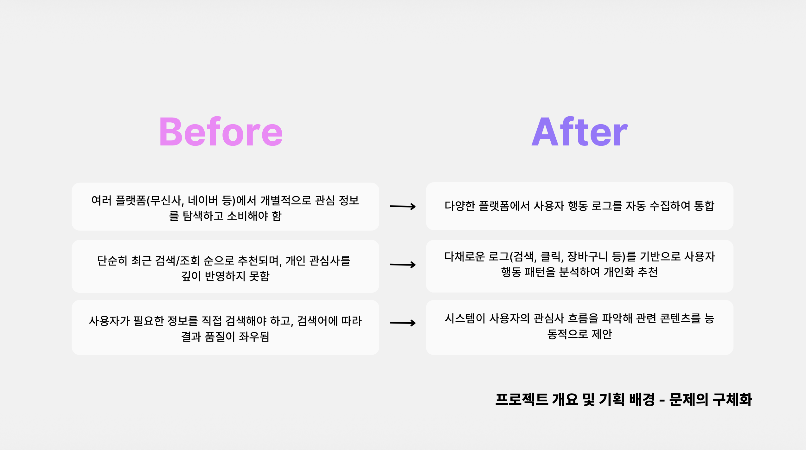
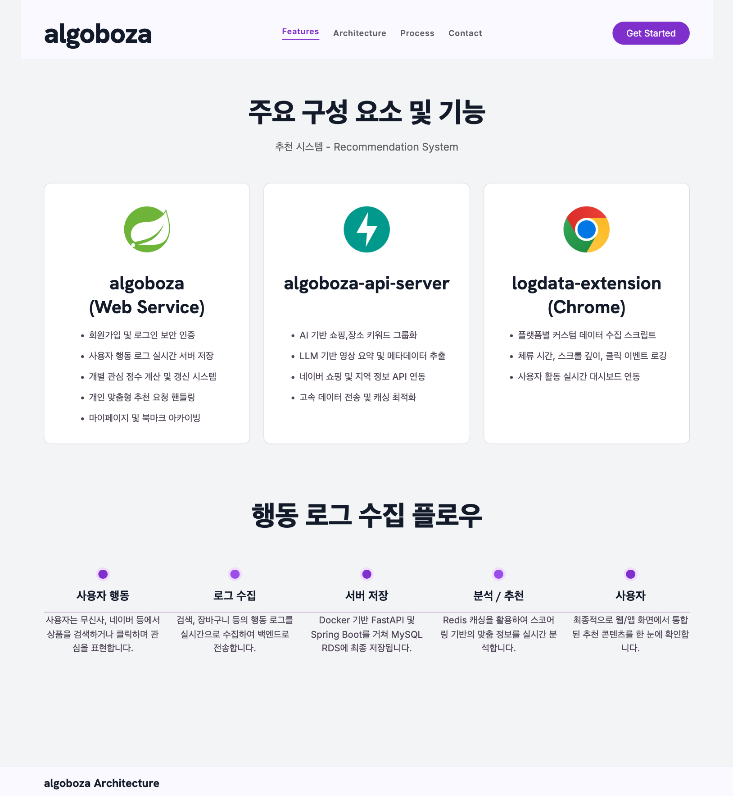
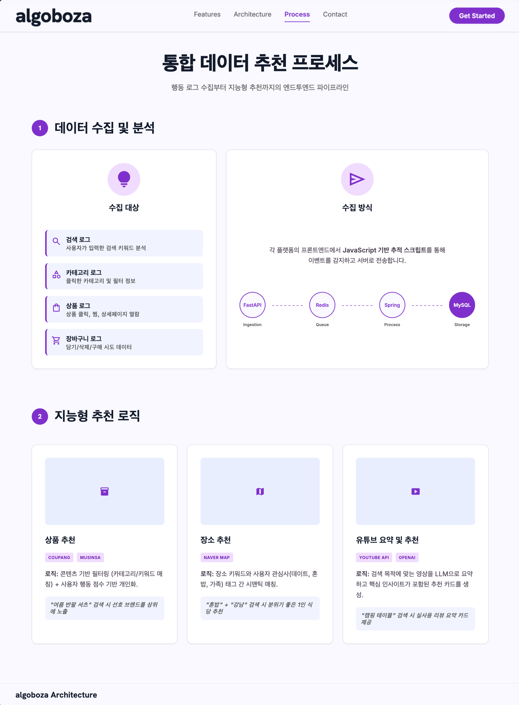
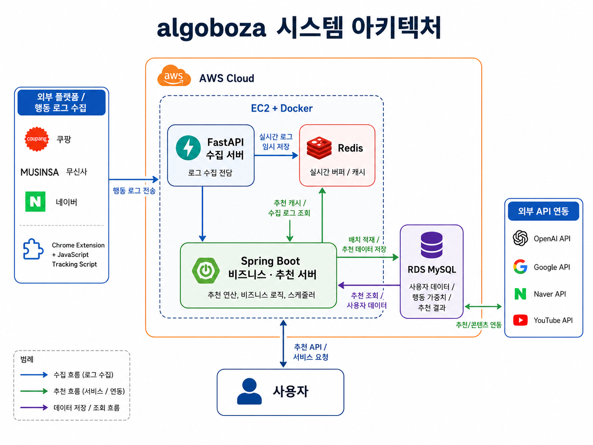

# Algoboza

> 사용자의 웹 행동 데이터를 분석해 관심사를 보여주고, 상품·장소·영상 콘텐츠를 개인화 추천하는 서비스

Algoboza는 여러 웹사이트에 흩어진 사용자의 검색, 조회, 클릭, 장바구니 등의 행동을 수집하고 분석합니다.  
수집한 행동에 가중치를 적용해 관심 키워드를 계산하고, 이를 기반으로 사용자가 자신의 관심사를 확인하거나 새로운 콘텐츠를 추천받을 수 있도록 돕습니다.


## 기획 배경


## 주요 기능



## 기대효과


## 아키텍처



## 기술 스택

| 구분 | 기술 |
| --- | --- |
| Web Client | React |
| Browser Extension | JavaScript, Chrome Extension Manifest V3 |
| Main Backend | Java 21, Spring Boot 3.4, Spring Security, Spring Data JPA, WebFlux |
| AI API Server | Python 3.12, FastAPI, Pydantic, HTTPX |
| Database | MySQL, Redis |
| Authentication | JWT, Email Verification |
| AI / External API | OpenAI API, YouTube Data API, YouTube Transcript API, Naver Search API |
| Infrastructure | AWS EC2, AWS RDS, Docker, Docker Compose |
| Build / Test | Gradle, JUnit 5, uv |

## 프로젝트 구성

```text

algoboza/                  # Spring Boot 메인 API 서버
├── algoboza-api-server/   # AI 키워드 처리 및 유튜브 추천 FastAPI 서버
└── logdata-extention/     # 사용자 행동 수집 Chrome 확장 프로그램
```

### `algoboza`

- 회원가입, 로그인, 이메일 인증 및 JWT 인가
- 브라우저 행동 로그 저장
- 관심 키워드 점수 계산
- 상품, 장소, 유튜브 추천 요청
- 마이페이지 차트와 북마크 관리

### `algoboza-api-server` [바로가기](https://github.com/skxcv312/algoboza-api-server)

- AI 기반 쇼핑·장소 키워드 그룹화
- 관심 점수 기반 유튜브 검색어 생성
- 유튜브 영상 검색 및 상세 정보 조회
- 영상 자막 추출 및 요약
- 네이버 쇼핑·지역 검색 API 연동

### `logdata-extention` [바로가기](https://github.com/skxcv312/algoboza-log-collection)

- Chrome Extension 기반 행동 추적
- 사이트별 상품, 카테고리, 검색, 장바구니 데이터 수집
- 체류 시간, 스크롤, 클릭 로그 생성
